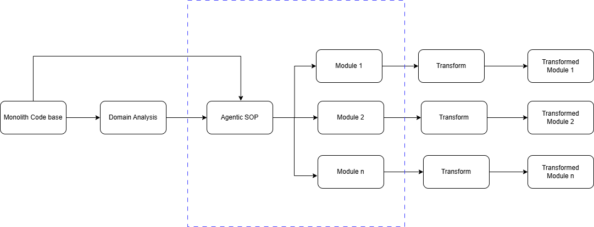
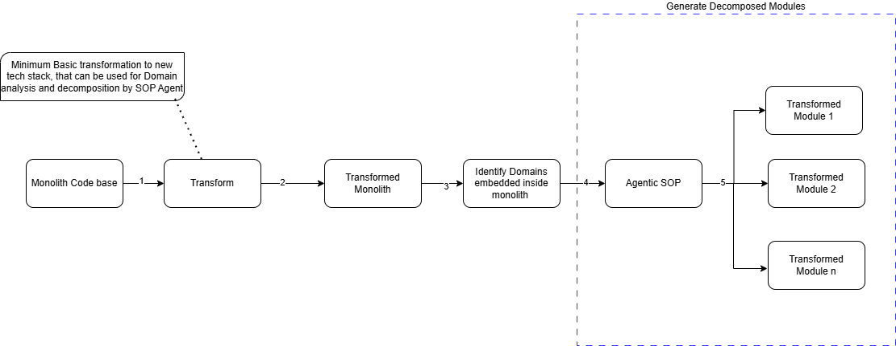
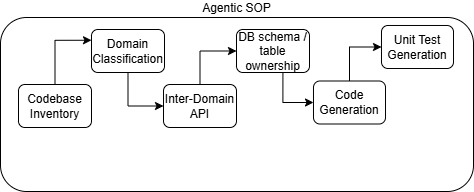

# Agentic SOP — Monolith Decomposition

## Overview
Analysis of monolith applications to break it down to individual modules per domain, generally takes week or more time, depending on the complexity and size of the application. This accelerator, will help accelerate this monolith breakdown and generate the domain wise segregated code within hours (best on test results).

The accelerator makes use of AWS Kiro Agent SOPs (Standard Operating Procedures) to achieve the required goal. To understand more about Agent SOP, check [here](https://goagentic.ch/)

**Note:** The Kiro Agent SOP's itself was generated with help of AWS Kiro using Vibe Coding mode. Use AWS Kiro to enhance this Agent SOP for any enhancement / custom requirements.

There are 2 possible flows to use this accelerator.

**Flow1: Monolith App Code -> Domain Analysis -> Decompose -> Transform -> Transformed modules.**

Use this flow when tech stack of the original monolith code is based on some of the current tech stack based on Spring, Node JS, React etc. It can be used for apps with old tech stack also, but difference will be that, for apps based on more recent tech stack, the generated decomposed modules can also be deployed and tested, but not for apps with legacy tech stack. For apps with legacy tech stack, the output will be modules generated as per domains identified, but can not be deployed / tested.



**Flow2: Monolith App Code -> Transformed Monolith App Code -> Domain Analysis -> Decompose -> Transformed modules.**

Use this flow, when tech stack of the original monolith code is based on legacy tech stack, for e.g. Struts, JSP, EJB etc. In this approach, before monolith can be domain wise decomposed into individual executable and deployable code, the original monolith code based is transformed (using agentic technique like AWS transform). By using this approach the input to the Agentic SOP is based on latest tech stack and the decomposed modules can be deployed and tested also.




**Note:** The scope of accelerator is limited to generating the decomposed modules (blue highlighted box). The Domain analysis (identifying to which all domains/sub-domains are embedded in the monolith) of the monolith application, can be done using any of the Domain analysis tool, like CBM etc. Once the Application Domains have been identified, it can be provided as an input to the accelerator and the accelerator will generate the decomposed modules, keeping the code level architecture same as original monolith application. Any enhancements / modernization to generated code w.r.t. additional capabilities for e.g. circuit breaker pattern, changing the tech stack or others, has to be handled outside the accelerator as of now.

Below diagram shows, what happens in process of breaking down the monolith to domain specific modules.



* Codebase Inventory: Scans the whole codebase to analyse the code base structure, dependency map, entry points, entity modesl, constant / config values, db tables and schema.
* Domain Classification: Analysis of which classes / methods belongs to which one or more Domains and action (move, split, shared, facade) to be taken on the class / method.
* Inter-Domain API: Analyze where-ever there are inter-domain dependencies in existing monolith, how will those be resolved when code is segregated across different modules as per domain decomposition.
* DB Schema / table ownership: Assign table ownership as per the domain boundaries and identifies cross-domain foreign key references and strategy to resolve those. Also, recommendation for data migration plan from shared monolith to separate domain database.
* Code Generation: Code segregration as per individual Domain decomposed modules.
* Unit test generation: This is optional step. This gets executed only if original code base had unit test cases. This can be generated separately also.  

**Note:** The decomposed modules generated by the accelerator make one change to the generated code. Whereever in the monolith code base, there were in-memory calls to cross domain class / methods, those are converted to RESTful API calls in the decomposed modules.

## Pre-requisites

1. Set up aws kiro-cli as per instructions at https://kiro.dev/docs/cli/installation/

2. Ensure you have active AWS Kiro subscription.

3. Download sample application code at: https://github.com/sacpopli/banking-monolith.git


## Key Features and Functions

1. Technology agnostic
2. Extendable to domain specific standards. (add Domain specific markdown file reference to the main monolith-decomposition.sop.me file). As of now the decomposition happens based on backend LLM training.
3. Domain classification of input code base - Class / method level.
4. Define what each domain service owns and how the services communicate.
5. Decompose the monolith’s shared database into domain-owned schemas, one per deployable service.
6. Generate Deployable units.
7. Unit test generation (conditional).
8. Produce a comprehensive report summarizing all findings and recommended next steps.

## Files

| File | Purpose |
|---|---|
| `monolith-decomposition.sop.md` | Main decomposition SOP — for modern stacks (Spring Boot, Node.js, Python, .NET Core). Produces fully executable decomposed modules. |
| `monolith-decomposition.skills.md` | Skills / hard gates file for the main SOP |
| `decomposition-config.example.json` | Example config for the main SOP — copy and fill in for your project |

---

## Quick Start

1. Open Windows Power Shell. Navigate to the root directory for this SOP project.

2. Type kiro-cli

3. After that, follow one of the below options.

#### Option A — Inline parameters
```
run monolith-decomposition.sop.md with monolith_path=../banking-monolith language=java domain_model="Customer & Party Management, Product & Account Servicing, Payments & Financial Transactions"
```

#### Option B — Config file (recommended for repeatable runs)
1. Copy the example config:
   ```
   cp SOP/decomposition-config.example.json decomposition-config.json
   ```
2. Edit `decomposition-config.json` with your values
3. Run:
   ```
   run monolith-decomposition.sop.md with config_file=./decomposition-config.json
   ```

#### Run a single phase
```
run monolith-decomposition.sop.md with config_file=./decomposition-config.json phase=2
```

---

### Supported target_stack values

| Value | Output stack |
|---|---|
| `java-spring-boot` | Spring Boot 3.x + JPA + Maven |
| `dotnet-core` | ASP.NET Core 8 + EF Core + C# 12 |
| `nodejs` | Node.js + Express + TypeORM |

---

## Domain Model Examples

| Industry | Framework | Example domain_model value |
|---|---|---|
| Banking | BIAN | `Customer & Party Management, Product & Account Servicing, Payments & Financial Transactions` |
| Telecoms | eTOM | `Customer Management, Product Management, Service Management, Resource Management` |
| Retail | ARTS | `Customer, Inventory, Order Management, Payment` |
| Insurance | ACORD | `Policy Management, Claims, Billing, Customer` |

---

## Test the monolith API

```bash
# Register a customer
curl -X POST http://localhost:8080/api/customers \
  -H "Content-Type: application/json" \
  -H "Authorization: Basic YWRtaW46YWRtaW4=" \
  -d '{"firstName":"John","lastName":"Doe","email":"john.doe@example.com","type":"RETAIL"}'

# Get a customer
curl -X GET http://localhost:8080/api/customers/1 \
  -H "Authorization: Basic YWRtaW46YWRtaW4="
```

---

## Test the decomposed customer-service (local profile)

```bash
# Start with local H2 profile
java -jar decomposed/customer-service/target/customer-service-1.0.0.jar --spring.profiles.active=local

# Register a customer
curl -X POST http://localhost:8081/api/customers \
  -H "Content-Type: application/json" \
  -H "Authorization: Basic YWRtaW46YWRtaW4=" \
  -d '{"firstName":"John","lastName":"Doe","email":"john.doe@example.com","type":"RETAIL"}'

# Get a customer
curl -X GET http://localhost:8081/api/customers/1 \
  -H "Authorization: Basic YWRtaW46YWRtaW4="
```
